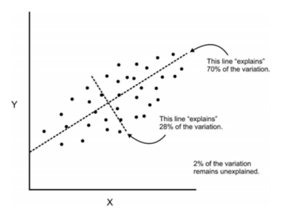
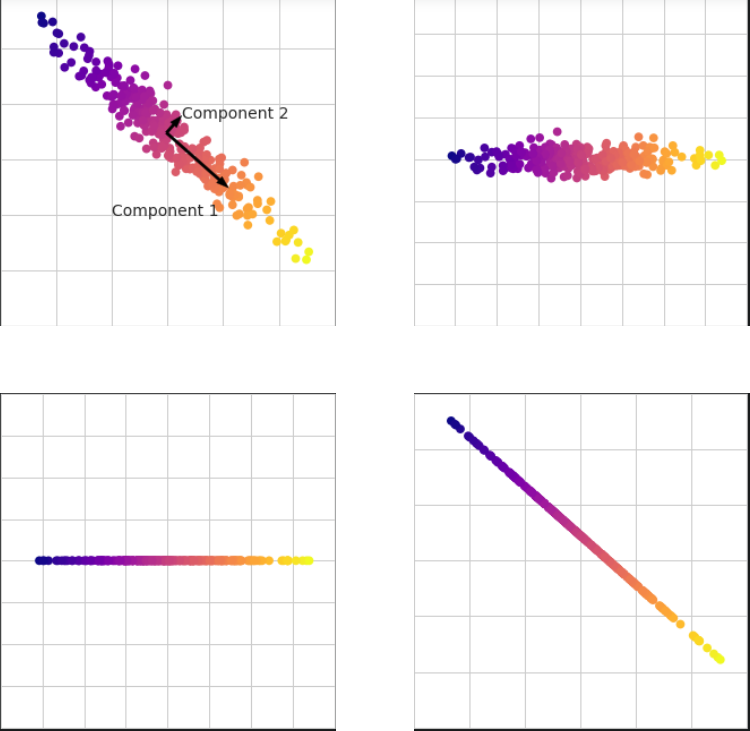

# Principal Component Analysis

Principal Component Analysis is an unsupervised algorithm used to reduce the dimensionality of data, making it easier to run Machine Learning models on the data. What does this mean? 
Assume a raw dataset with a regression line.<br>
<br>
Most of the variance in the data can be explained with the regression line. Therefore, it is called as our first component. Now let us drop a perpendicular to the component. It will be our second component.<br>
<br>
As we can see, most of the data's variance can be explained by both these components. By rotating the data keeping the compnents as the axes, we have a much simpler, one-dimensional view of previously two_dimensional data.


# Code
## Imports


```python
import matplotlib.pyplot as plt
import pandas as pd
import numpy as np
import seaborn as sns
%matplotlib inline
```

## Dataset
We are working on a dataset for breast cancer, this dataset has a particularly high dimensionality(many attributes) as you will see.


```python
from sklearn.datasets import load_breast_cancer
```


```python
cancer = load_breast_cancer()
```


```python
cancer.keys()
```


    dict_keys(['data', 'target', 'frame', 'target_names', 'DESCR', 'feature_names', 'filename', 'data_module'])


```python
print(cancer['DESCR'])
```

    .. _breast_cancer_dataset:
    
    Breast cancer wisconsin (diagnostic) dataset
    --------------------------------------------
    
    **Data Set Characteristics:**
    
        :Number of Instances: 569
    
        :Number of Attributes: 30 numeric, predictive attributes and the class
    
        :Attribute Information:
            - radius (mean of distances from center to points on the perimeter)
            - texture (standard deviation of gray-scale values)
            - perimeter
            - area
            - smoothness (local variation in radius lengths)
            - compactness (perimeter^2 / area - 1.0)
            - concavity (severity of concave portions of the contour)
            - concave points (number of concave portions of the contour)
            - symmetry
            - fractal dimension ("coastline approximation" - 1)
    
            The mean, standard error, and "worst" or largest (mean of the three
            worst/largest values) of these features were computed for each image,
            resulting in 30 features.  For instance, field 0 is Mean Radius, field
            10 is Radius SE, field 20 is Worst Radius.
    
            - class:
                    - WDBC-Malignant
                    - WDBC-Benign
    
        :Summary Statistics:
    
        ===================================== ====== ======
                                               Min    Max
        ===================================== ====== ======
        radius (mean):                        6.981  28.11
        texture (mean):                       9.71   39.28
        perimeter (mean):                     43.79  188.5
        area (mean):                          143.5  2501.0
        smoothness (mean):                    0.053  0.163
        compactness (mean):                   0.019  0.345
        concavity (mean):                     0.0    0.427
        concave points (mean):                0.0    0.201
        symmetry (mean):                      0.106  0.304
        fractal dimension (mean):             0.05   0.097
        radius (standard error):              0.112  2.873
        texture (standard error):             0.36   4.885
        perimeter (standard error):           0.757  21.98
        area (standard error):                6.802  542.2
        smoothness (standard error):          0.002  0.031
        compactness (standard error):         0.002  0.135
        concavity (standard error):           0.0    0.396
        concave points (standard error):      0.0    0.053
        symmetry (standard error):            0.008  0.079
        fractal dimension (standard error):   0.001  0.03
        radius (worst):                       7.93   36.04
        texture (worst):                      12.02  49.54
        perimeter (worst):                    50.41  251.2
        area (worst):                         185.2  4254.0
        smoothness (worst):                   0.071  0.223
        compactness (worst):                  0.027  1.058
        concavity (worst):                    0.0    1.252
        concave points (worst):               0.0    0.291
        symmetry (worst):                     0.156  0.664
        fractal dimension (worst):            0.055  0.208
        ===================================== ====== ======
    
        :Missing Attribute Values: None
    
        :Class Distribution: 212 - Malignant, 357 - Benign
    
        :Creator:  Dr. William H. Wolberg, W. Nick Street, Olvi L. Mangasarian
    
        :Donor: Nick Street
    
        :Date: November, 1995
    
    This is a copy of UCI ML Breast Cancer Wisconsin (Diagnostic) datasets.
    https://goo.gl/U2Uwz2
    
    Features are computed from a digitized image of a fine needle
    aspirate (FNA) of a breast mass.  They describe
    characteristics of the cell nuclei present in the image.
    
    Separating plane described above was obtained using
    Multisurface Method-Tree (MSM-T) [K. P. Bennett, "Decision Tree
    Construction Via Linear Programming." Proceedings of the 4th
    Midwest Artificial Intelligence and Cognitive Science Society,
    pp. 97-101, 1992], a classification method which uses linear
    programming to construct a decision tree.  Relevant features
    were selected using an exhaustive search in the space of 1-4
    features and 1-3 separating planes.
    
    The actual linear program used to obtain the separating plane
    in the 3-dimensional space is that described in:
    [K. P. Bennett and O. L. Mangasarian: "Robust Linear
    Programming Discrimination of Two Linearly Inseparable Sets",
    Optimization Methods and Software 1, 1992, 23-34].
    
    This database is also available through the UW CS ftp server:
    
    ftp ftp.cs.wisc.edu
    cd math-prog/cpo-dataset/machine-learn/WDBC/
    
    .. topic:: References
    
       - W.N. Street, W.H. Wolberg and O.L. Mangasarian. Nuclear feature extraction 
         for breast tumor diagnosis. IS&T/SPIE 1993 International Symposium on 
         Electronic Imaging: Science and Technology, volume 1905, pages 861-870,
         San Jose, CA, 1993.
       - O.L. Mangasarian, W.N. Street and W.H. Wolberg. Breast cancer diagnosis and 
         prognosis via linear programming. Operations Research, 43(4), pages 570-577, 
         July-August 1995.
       - W.H. Wolberg, W.N. Street, and O.L. Mangasarian. Machine learning techniques
         to diagnose breast cancer from fine-needle aspirates. Cancer Letters 77 (1994) 
         163-171.


```python
df = pd.DataFrame(cancer['data'],columns = cancer['feature_names'])
```


```python
df.head()
```


<div>
<style scoped>
    .dataframe tbody tr th:only-of-type {
        vertical-align: middle;
    }

    .dataframe tbody tr th {
        vertical-align: top;
    }

    .dataframe thead th {
        text-align: right;
    }
</style>
<table border="1" class="dataframe">
  <thead>
    <tr style="text-align: right;">
      <th></th>
      <th>mean radius</th>
      <th>mean texture</th>
      <th>mean perimeter</th>
      <th>mean area</th>
      <th>mean smoothness</th>
      <th>mean compactness</th>
      <th>mean concavity</th>
      <th>mean concave points</th>
      <th>mean symmetry</th>
      <th>mean fractal dimension</th>
      <th>...</th>
      <th>worst radius</th>
      <th>worst texture</th>
      <th>worst perimeter</th>
      <th>worst area</th>
      <th>worst smoothness</th>
      <th>worst compactness</th>
      <th>worst concavity</th>
      <th>worst concave points</th>
      <th>worst symmetry</th>
      <th>worst fractal dimension</th>
    </tr>
  </thead>
  <tbody>
    <tr>
      <th>0</th>
      <td>17.99</td>
      <td>10.38</td>
      <td>122.80</td>
      <td>1001.0</td>
      <td>0.11840</td>
      <td>0.27760</td>
      <td>0.3001</td>
      <td>0.14710</td>
      <td>0.2419</td>
      <td>0.07871</td>
      <td>...</td>
      <td>25.38</td>
      <td>17.33</td>
      <td>184.60</td>
      <td>2019.0</td>
      <td>0.1622</td>
      <td>0.6656</td>
      <td>0.7119</td>
      <td>0.2654</td>
      <td>0.4601</td>
      <td>0.11890</td>
    </tr>
    <tr>
      <th>1</th>
      <td>20.57</td>
      <td>17.77</td>
      <td>132.90</td>
      <td>1326.0</td>
      <td>0.08474</td>
      <td>0.07864</td>
      <td>0.0869</td>
      <td>0.07017</td>
      <td>0.1812</td>
      <td>0.05667</td>
      <td>...</td>
      <td>24.99</td>
      <td>23.41</td>
      <td>158.80</td>
      <td>1956.0</td>
      <td>0.1238</td>
      <td>0.1866</td>
      <td>0.2416</td>
      <td>0.1860</td>
      <td>0.2750</td>
      <td>0.08902</td>
    </tr>
    <tr>
      <th>2</th>
      <td>19.69</td>
      <td>21.25</td>
      <td>130.00</td>
      <td>1203.0</td>
      <td>0.10960</td>
      <td>0.15990</td>
      <td>0.1974</td>
      <td>0.12790</td>
      <td>0.2069</td>
      <td>0.05999</td>
      <td>...</td>
      <td>23.57</td>
      <td>25.53</td>
      <td>152.50</td>
      <td>1709.0</td>
      <td>0.1444</td>
      <td>0.4245</td>
      <td>0.4504</td>
      <td>0.2430</td>
      <td>0.3613</td>
      <td>0.08758</td>
    </tr>
    <tr>
      <th>3</th>
      <td>11.42</td>
      <td>20.38</td>
      <td>77.58</td>
      <td>386.1</td>
      <td>0.14250</td>
      <td>0.28390</td>
      <td>0.2414</td>
      <td>0.10520</td>
      <td>0.2597</td>
      <td>0.09744</td>
      <td>...</td>
      <td>14.91</td>
      <td>26.50</td>
      <td>98.87</td>
      <td>567.7</td>
      <td>0.2098</td>
      <td>0.8663</td>
      <td>0.6869</td>
      <td>0.2575</td>
      <td>0.6638</td>
      <td>0.17300</td>
    </tr>
    <tr>
      <th>4</th>
      <td>20.29</td>
      <td>14.34</td>
      <td>135.10</td>
      <td>1297.0</td>
      <td>0.10030</td>
      <td>0.13280</td>
      <td>0.1980</td>
      <td>0.10430</td>
      <td>0.1809</td>
      <td>0.05883</td>
      <td>...</td>
      <td>22.54</td>
      <td>16.67</td>
      <td>152.20</td>
      <td>1575.0</td>
      <td>0.1374</td>
      <td>0.2050</td>
      <td>0.4000</td>
      <td>0.1625</td>
      <td>0.2364</td>
      <td>0.07678</td>
    </tr>
  </tbody>
</table>
<p>5 rows × 30 columns</p>
</div>


As you can see, there are 30 attributes in this dataset. It is incredibly hard to understand which of the attributes contribute the most to breast cancer. We need to normalize the data first then reduce the dimensionality.


```python
cancer['target']
```


    array([0, 0, 0, 0, 0, 0, 0, 0, 0, 0, 0, 0, 0, 0, 0, 0, 0, 0, 0, 1, 1, 1,
           0, 0, 0, 0, 0, 0, 0, 0, 0, 0, 0, 0, 0, 0, 0, 1, 0, 0, 0, 0, 0, 0,
           0, 0, 1, 0, 1, 1, 1, 1, 1, 0, 0, 1, 0, 0, 1, 1, 1, 1, 0, 1, 0, 0,
           1, 1, 1, 1, 0, 1, 0, 0, 1, 0, 1, 0, 0, 1, 1, 1, 0, 0, 1, 0, 0, 0,
           1, 1, 1, 0, 1, 1, 0, 0, 1, 1, 1, 0, 0, 1, 1, 1, 1, 0, 1, 1, 0, 1,
           1, 1, 1, 1, 1, 1, 1, 0, 0, 0, 1, 0, 0, 1, 1, 1, 0, 0, 1, 0, 1, 0,
           0, 1, 0, 0, 1, 1, 0, 1, 1, 0, 1, 1, 1, 1, 0, 1, 1, 1, 1, 1, 1, 1,
           1, 1, 0, 1, 1, 1, 1, 0, 0, 1, 0, 1, 1, 0, 0, 1, 1, 0, 0, 1, 1, 1,
           1, 0, 1, 1, 0, 0, 0, 1, 0, 1, 0, 1, 1, 1, 0, 1, 1, 0, 0, 1, 0, 0,
           0, 0, 1, 0, 0, 0, 1, 0, 1, 0, 1, 1, 0, 1, 0, 0, 0, 0, 1, 1, 0, 0,
           1, 1, 1, 0, 1, 1, 1, 1, 1, 0, 0, 1, 1, 0, 1, 1, 0, 0, 1, 0, 1, 1,
           1, 1, 0, 1, 1, 1, 1, 1, 0, 1, 0, 0, 0, 0, 0, 0, 0, 0, 0, 0, 0, 0,
           0, 0, 1, 1, 1, 1, 1, 1, 0, 1, 0, 1, 1, 0, 1, 1, 0, 1, 0, 0, 1, 1,
           1, 1, 1, 1, 1, 1, 1, 1, 1, 1, 1, 0, 1, 1, 0, 1, 0, 1, 1, 1, 1, 1,
           1, 1, 1, 1, 1, 1, 1, 1, 1, 0, 1, 1, 1, 0, 1, 0, 1, 1, 1, 1, 0, 0,
           0, 1, 1, 1, 1, 0, 1, 0, 1, 0, 1, 1, 1, 0, 1, 1, 1, 1, 1, 1, 1, 0,
           0, 0, 1, 1, 1, 1, 1, 1, 1, 1, 1, 1, 1, 0, 0, 1, 0, 0, 0, 1, 0, 0,
           1, 1, 1, 1, 1, 0, 1, 1, 1, 1, 1, 0, 1, 1, 1, 0, 1, 1, 0, 0, 1, 1,
           1, 1, 1, 1, 0, 1, 1, 1, 1, 1, 1, 1, 0, 1, 1, 1, 1, 1, 0, 1, 1, 0,
           1, 1, 1, 1, 1, 1, 1, 1, 1, 1, 1, 1, 0, 1, 0, 0, 1, 0, 1, 1, 1, 1,
           1, 0, 1, 1, 0, 1, 0, 1, 1, 0, 1, 0, 1, 1, 1, 1, 1, 1, 1, 1, 0, 0,
           1, 1, 1, 1, 1, 1, 0, 1, 1, 1, 1, 1, 1, 1, 1, 1, 1, 0, 1, 1, 1, 1,
           1, 1, 1, 0, 1, 0, 1, 1, 0, 1, 1, 1, 1, 1, 0, 0, 1, 0, 1, 0, 1, 1,
           1, 1, 1, 0, 1, 1, 0, 1, 0, 1, 0, 0, 1, 1, 1, 0, 1, 1, 1, 1, 1, 1,
           1, 1, 1, 1, 1, 0, 1, 0, 0, 1, 1, 1, 1, 1, 1, 1, 1, 1, 1, 1, 1, 1,
           1, 1, 1, 1, 1, 1, 1, 1, 1, 1, 1, 1, 0, 0, 0, 0, 0, 0, 1])


```python
cancer['target_names']
```


    array(['malignant', 'benign'], dtype='<U9')


## Standard Scaler(Used to normalize the data)


```python
from sklearn.preprocessing import StandardScaler
```


```python
scaler = StandardScaler()
```


```python
scaler.fit(df)
```


    StandardScaler()


```python
scaled_data = scaler.transform(df)
```


```python
scaled_data
```


    array([[ 1.09706398, -2.07333501,  1.26993369, ...,  2.29607613,
             2.75062224,  1.93701461],
           [ 1.82982061, -0.35363241,  1.68595471, ...,  1.0870843 ,
            -0.24388967,  0.28118999],
           [ 1.57988811,  0.45618695,  1.56650313, ...,  1.95500035,
             1.152255  ,  0.20139121],
           ...,
           [ 0.70228425,  2.0455738 ,  0.67267578, ...,  0.41406869,
            -1.10454895, -0.31840916],
           [ 1.83834103,  2.33645719,  1.98252415, ...,  2.28998549,
             1.91908301,  2.21963528],
           [-1.80840125,  1.22179204, -1.81438851, ..., -1.74506282,
            -0.04813821, -0.75120669]])


## Using PCA
We will attempt to reduce the no of dimensions(or components) to 2.


```python
from sklearn.decomposition import PCA
```


```python
pca = PCA(n_components=2)
```


```python
pca.fit(scaled_data)
```


    PCA(n_components=2)


```python
x_pca = pca.transform(scaled_data)
```


```python
print(x_pca.shape,scaled_data.shape)
```

    (569, 2) (569, 30)


## Data Visualization


```python
plt.style.use("dark_background")
plt.figure(figsize=(8,6))
plt.scatter(x_pca[:,0],x_pca[:,1],c=cancer['target'])
plt.xlabel('First Principal Component')
plt.ylabel('Second Principal Component')

```


    Text(0, 0.5, 'Second Principal Component')


    

    


As you can see, we have reduced the dataset into two principal components, and there is a clear distinction between the negative and the positive cases.
